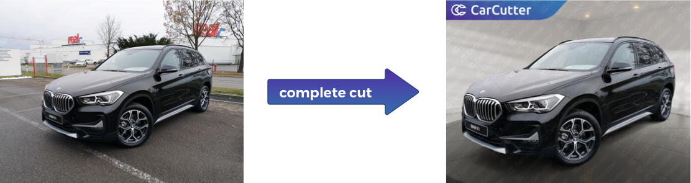
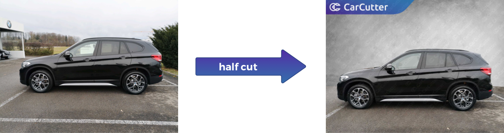
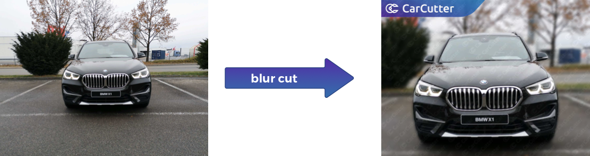

[](https://micardo.visualstudio.com/39917c9c-3518-4cad-b4a6-20d999411c53/_boards/board/t/f4ec0612-87da-4b03-8d7f-e17189e82039/Microsoft.RequirementCategory)
# carcutter-api-samples
Code samples for calling the CarCutter API

## Public demo access

You can easily process images and experiment with the different cut types via our **Web UI** at https://demo.car-cutter.com/.

Calling the public part of the **CarCutter API** is possible on Linux or Mac via the commands below.

### Complete cut

Completely extracts the car from its background and places it into a **rendered 3D showroom**.



```
curl -X POST https://api.car-cutter.com/vehicle/composition/segment \
  -H 'Cache-Control: no-cache' \
  -H 'Content-Type: multipart/form-data' \
  -F cut_type=complete \
  -F image=@images/source/front-left.jpg \
| base64 --decode > front-left_CC.jpg
```

### Half cut (a.k.a. normal cut)

Partly extracts the car from its background, **extends the ground** to an artificial horizon, and adds a backdrop.



```
curl -X POST https://api.car-cutter.com/vehicle/composition/segment \
  -H 'Cache-Control: no-cache' \
  -H 'Content-Type: multipart/form-data' \
  -F cut_type=normal \
  -F image=@images/source/side-left.jpg \
| base64 --decode > side-left_NC.jpg
```


### Blur cut

Blurs everything but the car, thus **focusing the view**.



```
curl -X POST https://api.car-cutter.com/vehicle/composition/segment \
  -H 'Cache-Control: no-cache' \
  -H 'Content-Type: multipart/form-data' \
  -F cut_type=blur \
  -F image=@images/source/front.jpg \
| base64 --decode > front_BC.jpg
```
